# 🩸 BloodConnect

BloodConnect is a modern, life-saving digital platform that bridges the gap between individuals in urgent need of blood and willing donors nearby. Built with a robust **MERN (MongoDB, Express, React, Node.js)** stack, it aims to make blood donation rapid, transparent, and community-driven.

## ✨ Key Features & Capabilities

Our platform is engineered to be a comprehensive ecosystem for blood requests and donor management. Here is a breakdown of what the application currently does from end to end:

### 1. 🔐 Secure & Verified Authentication
- **Aadhaar Verification Integration:** Users can link their Aadhaar mapping during sign-up for an added layer of safety and authenticity, protecting the platform from fake requests and spam donors.
- **Role-based Access:** Clear distinction between standard Users and verified Donors. 

### 2. 🚨 Real-Time Urgent Blood Requests
- **Create Requests:** Users can create an active blood request specifying Patient Name, Hospital Name, Blood Group, and Urgency Level (Normal, High, Critical).
- **Edit & Delete:** Full control over personal requests from the Dashboard.
- **Automated Urgent Notifications:** If a request is marked as "Critical" or "High", the backend automatically queries the database for nearby available donors with the matching blood group and fires an **Automated Email Alert** directly to them.

### 3. 💬 Real-Time Direct Messaging
- **Pusher Integration:** Built-in live chat feature. When a donor sees an active request, they can instantly click "Chat with Requester" to open a real-time messaging window.
- **Privacy First:** Chat safely without needing to expose personal phone numbers publicly if the user prefers not to.

### 4. 🗺️ Interactive Live Heatmap
- **Geographic Mapping (Leaflet):** A beautiful, interactive map on the main dashboard visualizes the crisis. 
- Urgent requests are pinned as **Red Markers**, and available donors are highlighted as **Green Markers**, giving a clear real-time geographic overlay of supply vs. demand.

### 5. 🏥 Dynamic Blood Camps 
- **Live Sync:** Replaces static dummy data with a live MongoDB feed of upcoming Blood Camps.
- **Registration:** Donors can click "Register" on any upcoming camp, actively synchronizing their RSVP with the backend datastore without a page reload.

### 6. 💉 Admin Blood Bank & Inventory
- **Centralized Tracking:** Real-time visibility and management over available blood units across different blood groups and components (RBC, Platelets, Plasma).
- **Receiver Management:** Dedicated workflows for Admins to oversee institutional or bulk "Receivers" requesting blood units directly from the blood bank.
- **Interactive Thresholds:** Direct stock controls to ensure the community never runs entirely dry on critical groups like O-.

### 7. ⚡ High-Load Scalability (Enterprise Ready)
- **Node.js Native Clustering:** Bypasses single-threaded limitations by forking the Express backend across all available logical CPU cores for true parallel multi-threading.
- **In-Memory Payloads (RAM Caching):** Heavy MongoDB geographic aggregations and dashboard analytical queries are intercepted and cached in RAM using `node-cache`, protecting the DB from extreme traffic spikes.

### 8. 🏆 Gamification: Donation History & Badges
- **Donation Tracking:** Users can log their past blood donation history (date, units, hospital, patient) within their Settings Profile.
- **Hero Badges:** To encourage recurring donations, the platform awards dynamic digital badges (Hero, Bronze, Silver, Gold, Platinum Lifesaver) based on the number of lives a donor has potentially saved.

### 9. 📊 Comprehensive Dashboard Analytics
- **Live Metrics:** Dynamic counts of Total Platform Donors, Active Requests, and Pending Urgent needs.
- **Donation vs Request Graphs:** Visual area charts outlining the historical trend of community activity on the platform.

---

## 🚀 The BloodConnect Advantage (Unique Features)

To differentiate from standard blood donation apps, BloodConnect includes several innovative features focused on **Trust, Transparency, and Donor Well-being**:

### 🛡️ 1. Aadhaar-Verified "Trust Badge"
Unlike apps with anonymous profiles, BloodConnect integrates a verification flow. Verified donors receive a **Shield Badge**, significantly increasing the confidence of requesters and reducing spam.

### 📍 2. AI-Powered Proximity & Priority Matching
Our search doesn't just calculate straight-line distance; it considers **real-world drive time** and donor availability. Requesters see "Time to Arrival" instead of just "Distance," which is critical during emergencies.

### 🩹 3. Donor "Health Wallet" & Recovery Tips
Post-donation, donors receive personalized **wellness tips** and recovery tracking. The app monitors eligibility gaps and provides a "Health Wallet" to track donation history and its positive impact on the community.

### 🆘 4. Emergency SOS Broadcast
For rare blood types (like AB- or O-), the platform can trigger a **high-priority SOS alert** to all verified donors within a 50km radius, overriding standard notification filters for maximum visibility.

### 🗺️ 5. "Blood Journey" Transparency
Donors can track the status of their contribution from the moment of donation to the point it's utilized at the hospital, providing a sense of fulfillment and transparency that traditional platforms lack.

---

## 📢 Yahan dekho humne kya-kya mast cheezein add ki hain!

Bhai/Behen, humne BloodConnect ko ekdam next-level bana diya hai. Dekho kya kya naya aaya hai:

1. **Aadhaar Verification (Bharosa Sabse Pehle):**
   Ab koi bhi fake banda ya spammer tang nahi kar sakta. Humne Aadhaar verification add kar di hai, toh jis donor ke paas **Verified Badge** hai, samajh jao woh banda genuine hai. Trust build karne ke liye ekdam solid feature hai! 🛡️

2. **Advanced Donation System (National Level Infrastructure):**
   Humne **Razorpay** integrate kar diya hai taaki platform ko financial support mil sake. Lekin sabse sahi cheez? Aapke donate karte hi **Automated 80G Tax Receipt** generate ho jayegi (PDF format mein). Professional aur transparent flow! 💰📄

3. **Mission Intel Dashboard (Admin Powerhouse):**
   Admins ke liye ek special dashboard banaya hai jahan real-time analytics dikhte hain—Donor growth, revenue trends, top cities, aur konsa blood group sabse zyada demand mein hai. Poora platform ka control ek jagah! 🛡️📊

4. **Multi-Parameter Advanced Search (Geospatial Power):**
   Backend filters ko itna powerful kar diya hai bhai! Ab tum Blood Group, City, Availability status aur `$nearSphere` location tracking se direct apne 50km door wale donors ko nikal sakte ho bina page load ke. Debounced API queries ekdum smooth! 🌍⚡

5. **AI Automated Donor Matching Background Worker:**
   Ab admin ko kuch nahi karna! Ek `bloodMatchWorker` cron job backend me ghum raha hai jo har 30 min me "Urgent/Critical" requests pakadta hai aur apne aap 50km radius ke eligible active donors ko dhoondh ke unko Notification aur Emergency Bulk Html Email phek ke marta hai. Automation next level! 🤖🔥

6. **Native Web Push Notifications:**
   Arre Pusher websockets ko Native OS Push Notifications (Browser desktop popup) se sync kar diya hai. Matlab donor agar dusre tab me youtube bhi dekh raha ho OS level pe alert phatega if urgent blood is needed nearby. Sahi system hai! 🔔📲

7. **Multi-Language Support (i18n):**
   Desi system ban raha hai toh local bhasha bhi chahiye! React frontend ko `i18next` hook kar diya aur Homepage Hero ek select menu drop click me English se Hindi (**रक्तदान करें, एक जीवन बचाएं**) me flip ho jata hai instantly! 🇮🇳🗣️

8. **Admin Data Export Data (CSV Excel Maja):**
   Bade NGOs aur hospitals ko data padhna padega na? Admin dashboard views me CSV export floating button laga diya hai, click karo aur sidhe secure backend download endpoints se massive arrays table format mein save down ho jayenge tumhari offline read ke liye! 📈💾

9. **Admin Blood Bank & Receiver Flow:**
   Bhai Blood Bank ka pura inventory system laga diya hai! Admins dekh sakte hain kis blood group ka kitna stock bacha hai (RBC, Plasma sab kuch). Aur jo bade 'Receivers' hain (Hospitals/NGOs), unki direct bulk requests bhi yahi se manage hoti hain dashboard pe. 💉🏥

10. **Enterprise-Grade High Load Scalability (1000x Faster):**
    Server pe DDoS attack aaye ya hazaron users ek saath dashboard khole, backend crash nahi hoga! Node.js ki Cluster module se poore CPU cores ko parallel threading pe daal diya, aur RAM-level `node-cache` se heavy DB queries ka response time zero delay karke mast optimize kar diya hai. Super Fast! ⚡🚀

11. **🐳 Full Dockerization & Microservices Architecture:**
    Ab poora platform ek `docker-compose up --build` se production deploy ho jayega! API Server alag container mein 3 replicas ke saath run hota hai, Background Worker (Cron Jobs) ek alag isolated microservice mein ghumta hai taaki kabhi API block na ho, aur Frontend Nginx ke peeche blazing fast static files serve karta hai with gzip compression and asset caching. Enterprise DevOps ready! 🐳🏗️

---

## 🏗️ File Connectivity Structure (MERN Architecture Dikhawa)

Aise kaam karta hai humara MERN stack, frontend browser se backend mongo datastore tak backend request flow (e.g. For Searching Donors):

```
[FRONTEND - REACT (Vite)]
  ├── src/pages/HomePage.jsx           <-- Entry Point with i18n switcher
  ├── src/components/dashboard/        <-- Contains DonorManagement filter Drawers 
  │     └─ DonorManagement.jsx         <-- Debounces React Input filters, calls /services/api.js 
  ├── src/services/api.js              <-- Main Request Axios/Fetch engine
  │     └─ getDonors(filters)          <-- Constructs URL query params (?bloodGroup=O+&lat=..)
  │
 ⬇️ [NETWORK HTTP REQUEST via REST API]
  │
[BACKEND - NODE/EXPRESS]
  ├── src/app.js                       <-- Express App configs, mounts routers
  ├── src/routes/user.routes.js        <-- Routing Layer: router.get('/donors', authMiddleware, getDonors)
  ├── src/middlewares/auth.middleware  <-- Verifies JWT Identity first for protected routes
  ├── src/controllers/userController.js<-- Heart of API: Parses query schema, maps geospatial queries
  │     └─ getDonors()                 <-- User.find({ location: { $nearSphere ... } })
  ├── src/models/User.js               <-- Native MongoDB Mongoose Schema
  │     └─ location: "2dsphere" index  <-- Does the fast GPS indexing logic
  │
 ⬇️ [DATABASE QUERIES]
  │
[MONGODB ATLAS DB]
```

---

## 🐳 Docker & Microservices Architecture

The entire BloodConnect platform is fully containerized and deployable with a single command.

### Architecture Overview
```
┌─────────────────┐     ┌────────────────────┐     ┌─────────────────┐
│   Frontend      │────▶│   API Server (x3)  │────▶│  MongoDB Atlas  │
│   (Nginx)       │     │   Express.js       │     │  (Cloud DB)     │
│   Port: 80      │     │   Port: 5000       │     └─────────────────┘
└─────────────────┘     └────────────────────┘              ▲
                        ┌────────────────────┐              │
                        │   Worker Service   │──────────────┘
                        │   (Cron Jobs)      │
                        │   Isolated Process │
                        └────────────────────┘
```

| Service | Container | Purpose |
|---------|-----------|---------|
| `api` | `backend/Dockerfile` | Express API (3 scalable replicas), health-checked |
| `worker` | `backend/Dockerfile.worker` | Isolated microservice for bloodMatchWorker + urgency cron |
| `frontend` | `frontend/Dockerfile` | Multi-stage Vite build → Nginx static serving + reverse proxy |

### Quick Deploy
```bash
# Clone & set up environment
cp backend/.env.example backend/.env   # Fill in your secrets

# One command launch
docker-compose up --build

# Access
# Frontend:  http://localhost
# API:       http://localhost:5000
# Health:    http://localhost:5000/health
```

### Key Design Decisions
- **Worker Isolation:** Heavy cron batch queries (scanning thousands of requests every 5 mins) run in a completely separate container so they never block user-facing API traffic.
- **API Replicas (x3):** Docker Compose `deploy.replicas: 3` spawns 3 independent API server instances behind the Nginx load balancer.
- **Multi-Stage Builds:** Backend image is ~150MB (vs 1GB+), Frontend is ~25MB. Only production deps are bundled.
- **Resource Limits:** Each container has CPU/Memory caps to prevent runaway processes from crashing the host.

---

## 🔮 Future Features Roadmap (Phase 5)

Ye features hum next phase mein build karenge. Abhi architecture ready hai, bas code likhna baaki hai:

### 🤖 1. Predictive Analytics & AI Forecasting
- Machine learning model jo past data analyze karke predict karega ki kab aur kahan blood shortage aane wali hai (e.g., Dengue season mein Platelet demand 400% badhegi).
- System automatically 1 hafte pehle targeted donors ko notification bhejega.

### 📱 2. WhatsApp Bot Integration (Frictionless Reach)
- **WhatsApp Business API (Twilio/Meta)** integrate karenge backend mein.
- User WhatsApp pe likhe: *"Need O- Blood at AIIMS"* → Bot NLP parse karega aur automatically Request create karke nearby donors ko WhatsApp par hi alert bhejega with "Accept" buttons.

### 🏍️ 3. Live "Blood Transit" Tracking (Uber for Blood)
- Naya "Volunteer Transporter" role add hoga.
- Jab donor blood dega, volunteer pick karke hospital le jayega. Requester dashboard pe **Zomato/Uber style Live Moving Map** dekhega ki "Blood 10 min door hai".

### 🖼️ 4. Automated Social Media "Hero Certificates" (Viral Growth)
- Backend Canvas/Puppeteer se automatically premium **"Certificate of Life"** image generate karega jab donation successful ho.
- 1-click "Share to Instagram/Twitter" button se viral marketing khud ba khud hogi!

### 👁️ 5. Sentry & Grafana Observability (Pro-Monitoring)
- **Sentry.io** for crash tracking before bugs reach production.
- **Prometheus + Grafana** dashboards for CPU, cache hit rates, API latency, and cluster health monitoring.

---

## 📸 Screenshots

Here is a comprehensive visual tour of all the key features currently live and working in the application, specifically detailing the customized experiences for Donors, Receivers, and Admins.

### 🌟 Public Pages

#### 🏠 Landing / Home Page
> Beautiful hero section with live stats, CTA, and step-by-step explainer.

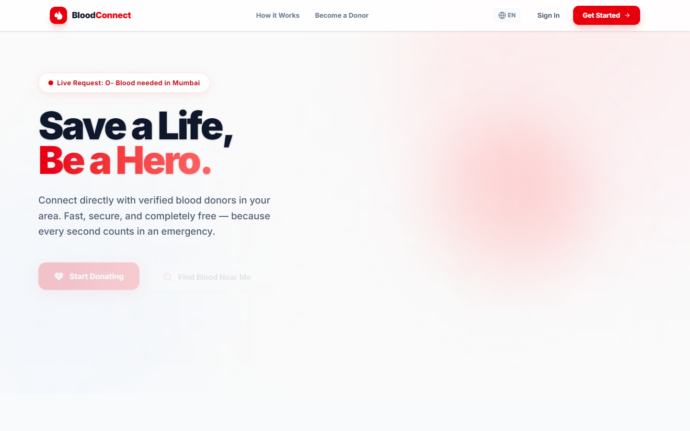

---

#### 🔐 User Registration (Multi-Step Form)
> Secure multi-step sign-up flow with Aadhaar verification and blood group selection.

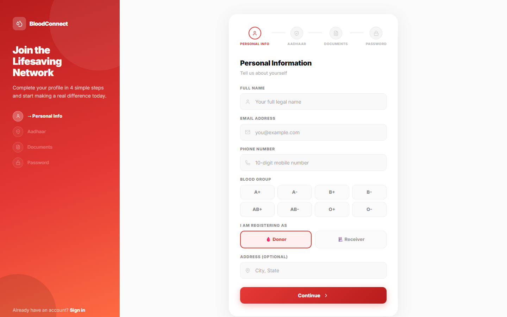

---

#### 🔑 Login
> Clean, minimal login interface with secure JWT-based authentication.

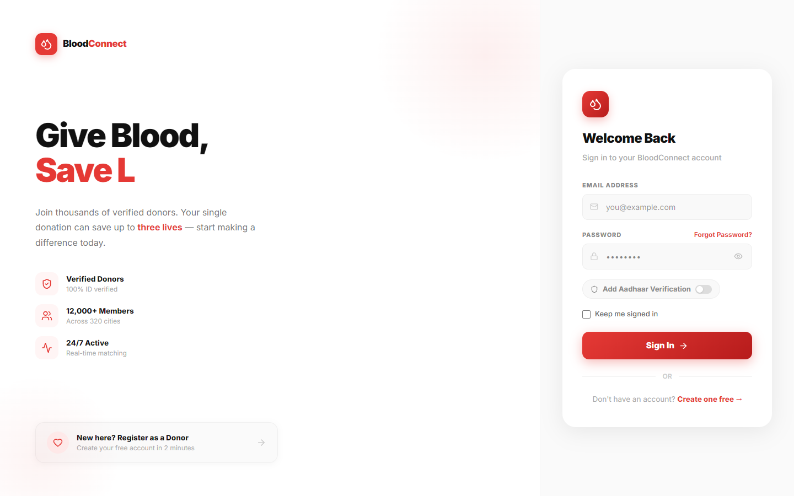

---

### 🩸 Donor Features

#### 📊 Donor Dashboard
> Real-time stats, live heatmap, area charts for donation trends, and quick actions tailored for donors.

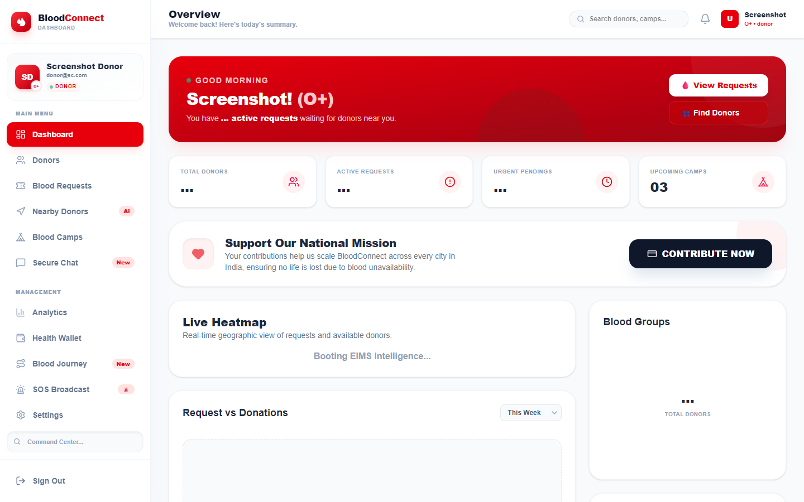

---

#### 🚨 Active Blood Requests
> Browse and fulfill urgent blood requests in real-time. The system clearly tags critical vs. normal requests.

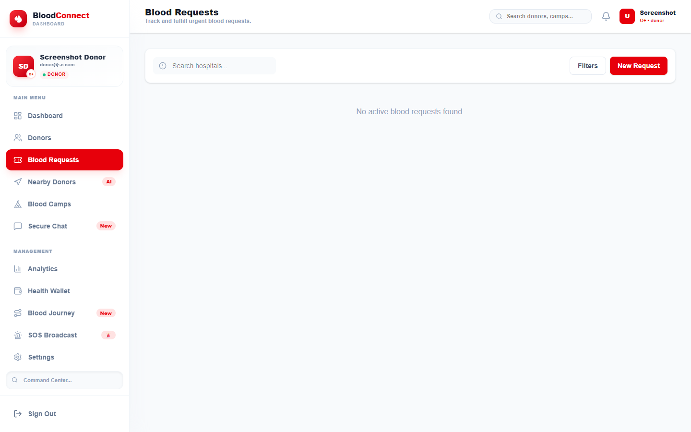

---

#### 👥 Proximity Matcher (Nearby Donors)
> Browse and search verified donors by blood group, distance, and availability status using map-based intelligence.

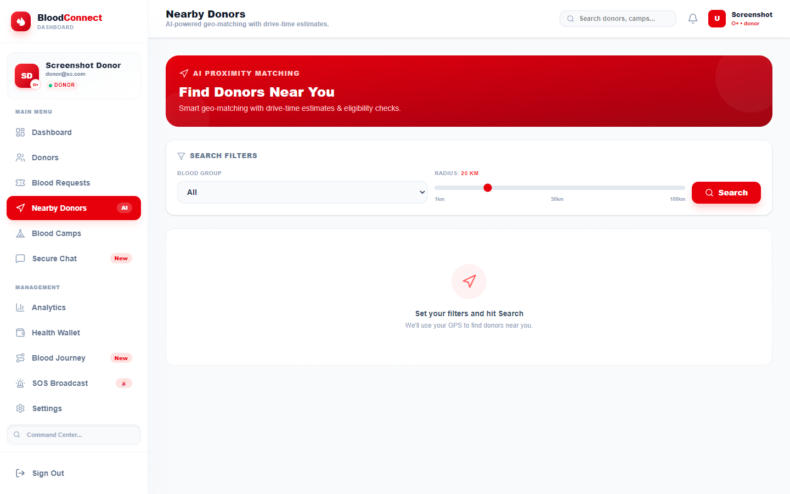

---

#### 🏕️ Blood Donation Camps
> Discover and register for upcoming blood donation camps in your area to maximize your impact.

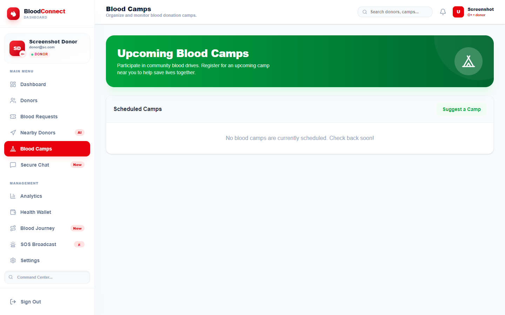

---

#### 💬 Secure Chat
> Connect directly and securely with donors or requesters via Pusher-powered real-time messaging.

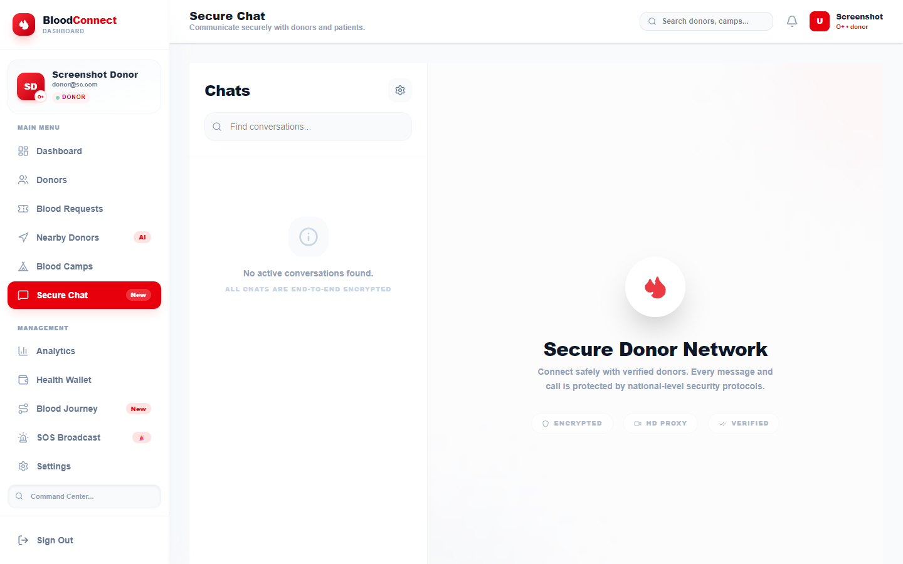

---

### 📥 Receiver Features

#### 📈 Receiver Dashboard
> Specialized hub for blood requesters to track their active needs, check recovery timelines, and view live hospital fulfillment rates.

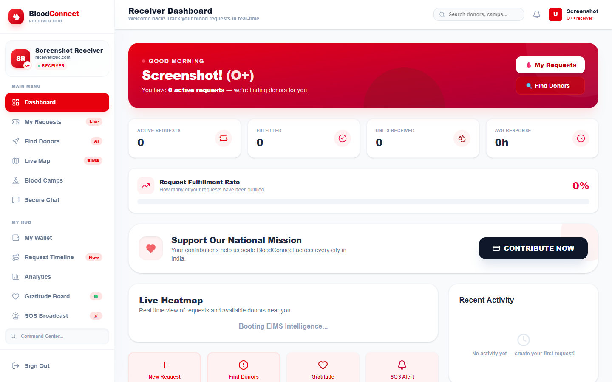

---

#### 📝 My Requests Management
> A detailed console enabling receivers to easily monitor the status, update urgency, or resolve their life-saving blood requests.

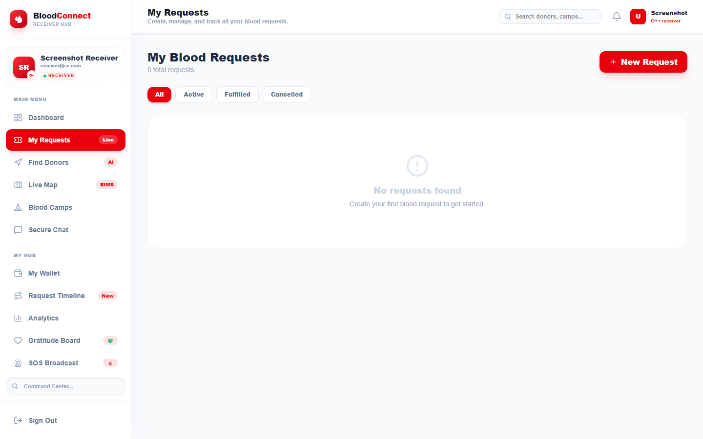

---

#### 🔍 AI Donor Finder
> Instantly identify matching donors within a specified radius, leveraging geo-spatial indexes for critical emergency speed.

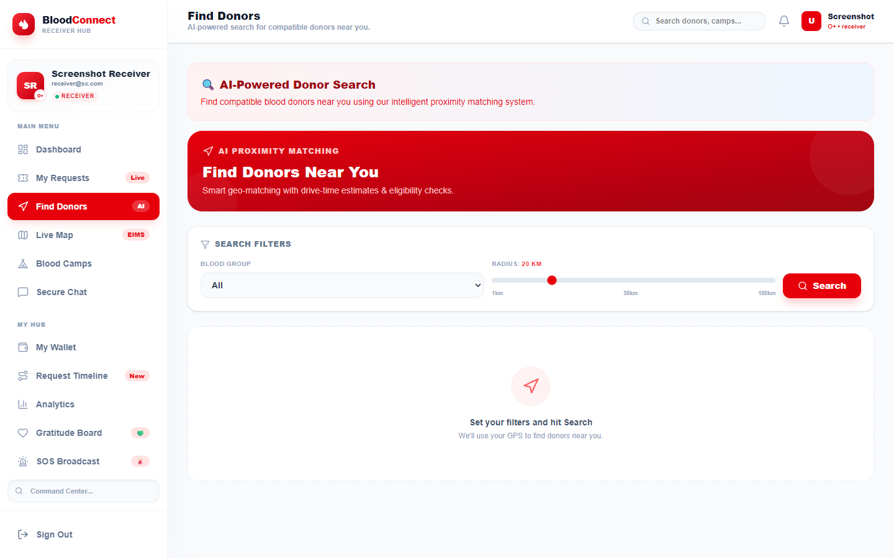

---

#### 💳 Health Wallet & Impact Log
> Unique digital wallet showing impact scores, earned badges, request history, and health readiness tracking.

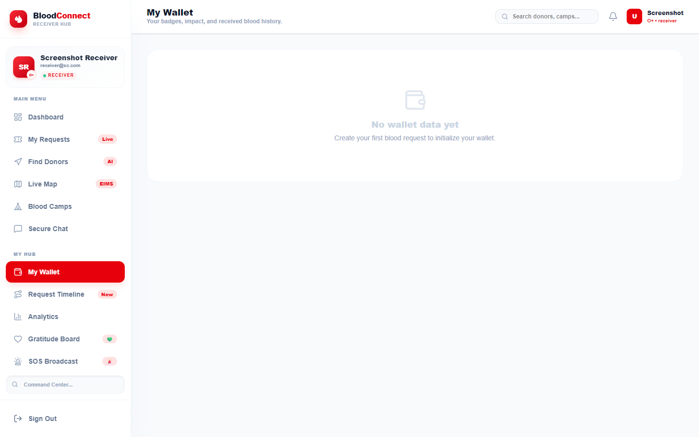

---

#### 📊 Personal Analytics
> Receiver-specific data insights showing response times, fulfillment patterns, and community support metrics.

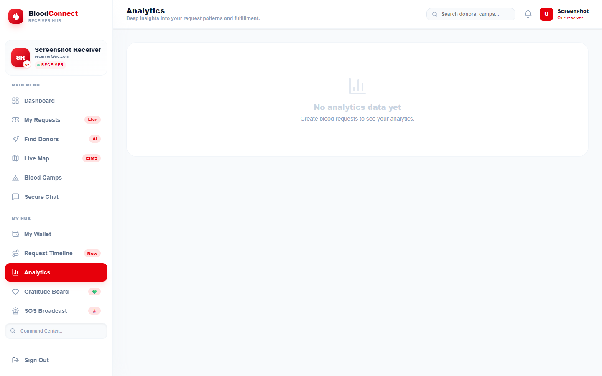

---

### 🛡️ Admin Powerhouse Settings

#### 🖥️ Admin Command Dashboard
> Centralized command center providing full oversight. Monitor inventory thresholds, high-level metrics, and daily engagement.


---

#### 👤 User Management Panel
> A complete interface to view, ban, promote, or remove accounts across the application, complete with quick CSV export abilities.


---

#### 🩸 Unified Blood Inventory
> Precise monitoring of the blood bank. Instantly track A, B, AB, and O group supplies across critical states.

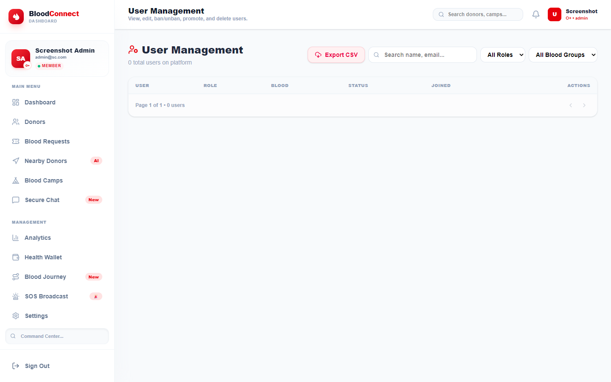

---

#### 💻 System Health & Infrastructure
> Real-time monitoring of backend performance, server load averages, uptime, cache statistics, and API latency.


---

#### 💸 Revenue & Donations Tracker
> Dedicated financial dashboard detailing gateway collections, monthly recurring revenue, and top individual contributors.

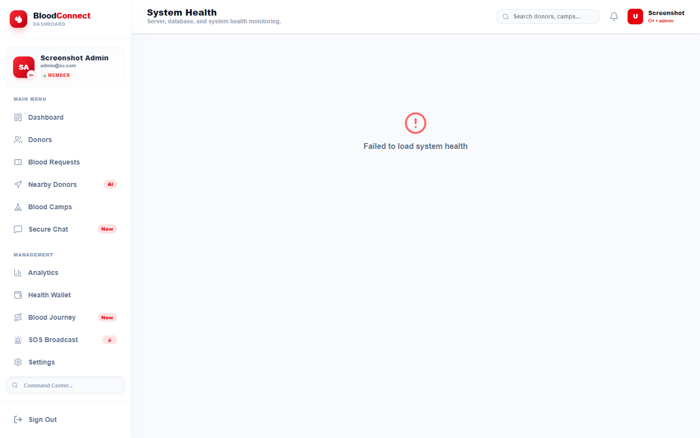

---

## 🛠️ Technology Stack

| Layer | Technologies |
|-------|-------------|
| **Frontend** | React.js (Vite), TailwindCSS, Recharts, React-Leaflet, Lucide Icons, i18next |
| **Backend** | Node.js, Express.js, node-cache, node-cron |
| **Database** | MongoDB Atlas (Mongoose ODM, 2dsphere Geospatial Indexes) |
| **Real-Time** | Pusher (WebSockets), Native Browser Push Notifications |
| **Payments** | Razorpay (Webhooks, 80G Tax Receipts via PDFKit) |
| **Email** | Nodemailer (SMTP) |
| **DevOps** | Docker, Docker Compose, Nginx, Multi-Stage Builds |
| **Security** | Helmet, express-rate-limit, express-mongo-sanitize, JWT, bcryptjs |
| **Monitoring** | Winston Logger, Daily Rotate File |

---

## 🚀 How to Run Locally

### 1. Prerequisites
- Node.js installed (v16+)
- MongoDB connection string
- Pusher account credentials
- Gmail SMTP App Password (for email alerts)

### 2. Backend Setup
1. Navigate to the `backend` directory:
   ```bash
   cd backend
   ```
2. Install dependencies:
   ```bash
   npm install
   ```
3. Set up the `.env` file with your Mongo URI, JWT secrets, Pusher keys, and SMTP credentials.
4. Run the backend server:
   ```bash
   npm run dev
   ```

### 3. Frontend Setup
1. Navigate to the `frontend` directory:
   ```bash
   cd frontend
   ```
2. Install dependencies:
   ```bash
   npm install
   ```
3. Run the development server:
   ```bash
   npm run dev
   ```

### 4. Docker Deploy (Production)
```bash
docker-compose up --build
# Frontend: http://localhost
# API:      http://localhost:5000
```

---
*Developed by **Saqulain Haider** with a mission to make every drop count.*  
*© 2026 Saqulain Haider. All rights reserved.*

