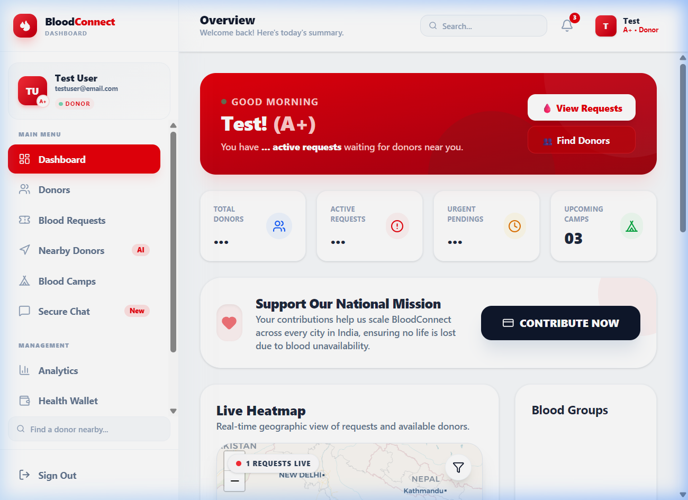
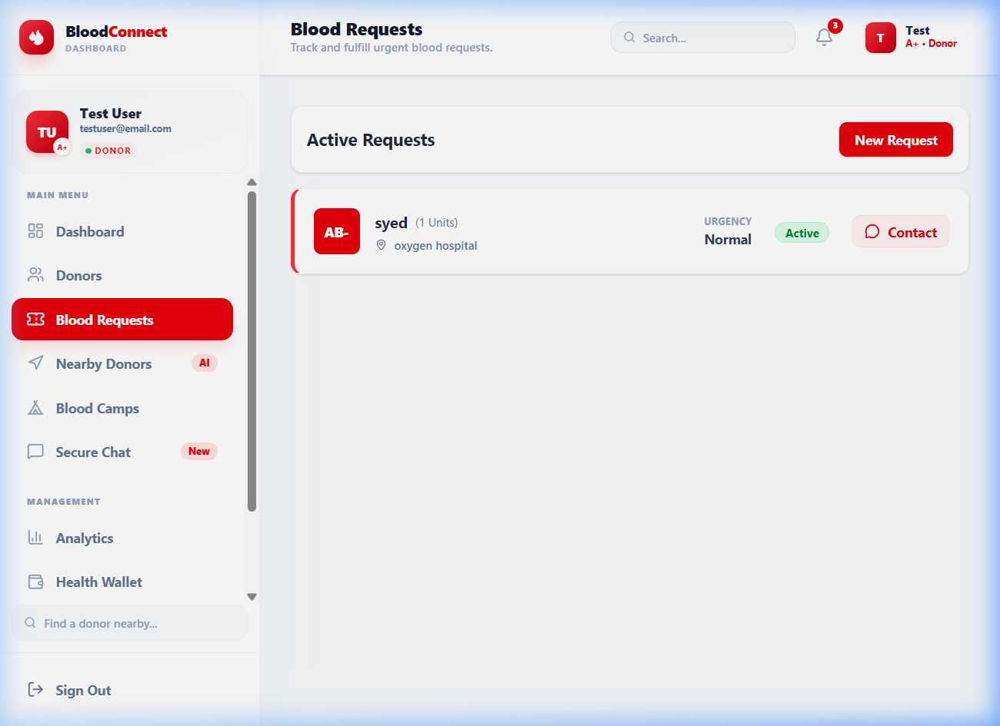
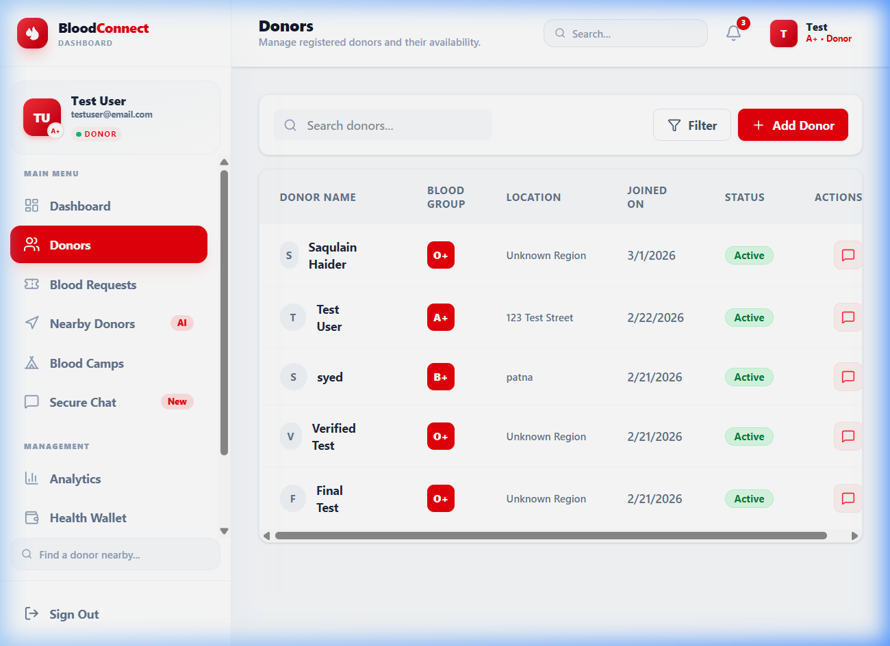
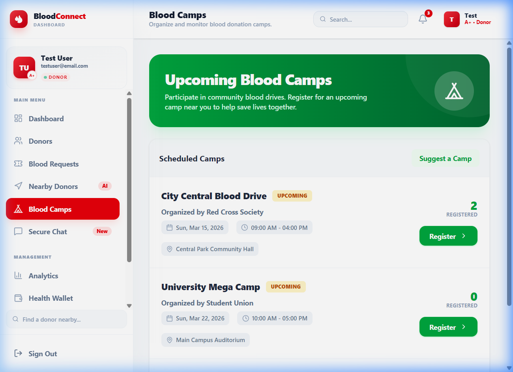

# 🩸 BloodConnect

BloodConnect is a modern, life-saving digital platform that bridges the gap between individuals in urgent need of blood and willing donors nearby. Built with a robust **MERN (MongoDB, Express, React, Node.js)** stack, it aims to make blood donation rapid, transparent, and community-driven.

## ✨ Key Features & Capabilities

Our platform is engineered to be a comprehensive ecosystem for blood requests and donor management. Here is a breakdown of what the application currently does from end to end:

### 1. 🔐 Secure & Verified Authentication
- **Aadhaar Verification Integration:** Users can link their Aadhaar mapping during sign-up for an added layer of safety and authenticity, protecting the platform from fake requests and spam donors.
- **Role-based Access:** Clear distinction between standard Users and verified Donors. 

### 2. 🚨 Real-Time Urgent Blood Requests
- **Create Requests:** Users can create an active blood request specifying Patient Name, Hospital Name, Blood Group, and Urgency Level (Normal, High, Critical).
- **Edit & Delete:** Full control over personal requests from the Dashboard.
- **Automated Urgent Notifications:** If a request is marked as "Critical" or "High", the backend automatically queries the database for nearby available donors with the matching blood group and fires an **Automated Email Alert** directly to them.

### 3. 💬 Real-Time Direct Messaging
- **Pusher Integration:** Built-in live chat feature. When a donor sees an active request, they can instantly click "Chat with Requester" to open a real-time messaging window.
- **Privacy First:** Chat safely without needing to expose personal phone numbers publicly if the user prefers not to.

### 4. 🗺️ Interactive Live Heatmap
- **Geographic Mapping (Leaflet):** A beautiful, interactive map on the main dashboard visualizes the crisis. 
- Urgent requests are pinned as **Red Markers**, and available donors are highlighted as **Green Markers**, giving a clear real-time geographic overlay of supply vs. demand.

### 5. 🏥 Dynamic Blood Camps 
- **Live Sync:** Replaces static dummy data with a live MongoDB feed of upcoming Blood Camps.
- **Registration:** Donors can click "Register" on any upcoming camp, actively synchronizing their RSVP with the backend datastore without a page reload.

### 6. 🏆 Gamification: Donation History & Badges
- **Donation Tracking:** Users can log their past blood donation history (date, units, hospital, patient) within their Settings Profile.
- **Hero Badges:** To encourage recurring donations, the platform awards dynamic digital badges (Hero, Bronze, Silver, Gold, Platinum Lifesaver) based on the number of lives a donor has potentially saved.

### 7. 📊 Comprehensive Dashboard Analytics
- **Live Metrics:** Dynamic counts of Total Platform Donors, Active Requests, and Pending Urgent needs.
- **Donation vs Request Graphs:** Visual area charts outlining the historical trend of community activity on the platform.

---

## 🚀 The BloodConnect Advantage (Unique Features)

To differentiate from standard blood donation apps, BloodConnect includes several innovative features focused on **Trust, Transparency, and Donor Well-being**:

### 🛡️ 1. Aadhaar-Verified "Trust Badge"
Unlike apps with anonymous profiles, BloodConnect integrates a verification flow. Verified donors receive a **Shield Badge**, significantly increasing the confidence of requesters and reducing spam.

### 📍 2. AI-Powered Proximity & Priority Matching
Our search doesn't just calculate straight-line distance; it considers **real-world drive time** and donor availability. Requesters see "Time to Arrival" instead of just "Distance," which is critical during emergencies.

### 🩹 3. Donor "Health Wallet" & Recovery Tips
Post-donation, donors receive personalized **wellness tips** and recovery tracking. The app monitors eligibility gaps and provides a "Health Wallet" to track donation history and its positive impact on the community.

### 🆘 4. Emergency SOS Broadcast
For rare blood types (like AB- or O-), the platform can trigger a **high-priority SOS alert** to all verified donors within a 50km radius, overriding standard notification filters for maximum visibility.

### 🗺️ 5. "Blood Journey" Transparency
Donors can track the status of their contribution from the moment of donation to the point it's utilized at the hospital, providing a sense of fulfillment and transparency that traditional platforms lack.

---

## 📢 Yahan dekho humne kya-kya mast cheezein add ki hain!

Bhai/Behen, humne BloodConnect ko ekdam next-level bana diya hai. Dekho kya kya naya aaya hai:

1. **Aadhaar Verification (Bharosa Sabse Pehle):**
   Ab koi bhi fake banda ya spammer tang nahi kar sakta. Humne Aadhaar verification add kar di hai, toh jis donor ke paas **Verified Badge** hai, samajh jao woh banda genuine hai. Trust build karne ke liye ekdam solid feature hai! 🛡️

2. **Advanced Donation System (National Level Infrastructure):**
   Humne **Razorpay** integrate kar diya hai taaki platform ko financial support mil sake. Lekin sabse sahi cheez? Aapke donate karte hi **Automated 80G Tax Receipt** generate ho jayegi (PDF format mein). Professional aur transparent flow! 💰📄

3. **Mission Intel Dashboard (Admin Powerhouse):**
   Admins ke liye ek special dashboard banaya hai jahan real-time analytics dikhte hain—Donor growth, revenue trends, top cities, aur konsa blood group sabse zyada demand mein hai. Poora platform ka control ek jagah! 🛡️📊

4. **AI-Powered Proximity Matching:**
   Sirf distance nahi, humne **Real-world Drive Time** bhi add kiya hai. Ab aapko pata chalega ki donor kitne minute mein pahunch sakta hai. Fast speed, fast support! 🤖🗺️

5. **Donor Health Wallet & Badges:**
   Aapki donation journey track hogi mast badges ke saath (**Bronze to Platinum**). Saath mein **Recovery Tracker** bhi hai jo bataega aap kab dobara donate kar sakte ho, aur 6 kaafi useful health tips bhi milti hain. 💊🏆

6. **Emergency SOS Broadcast:**
   Agar rare group ya critical emergency hai, toh **SOS Alert** trigger karo! 50km radius ke saare available donors ko real-time notification jaega **Pusher** ke zariye. Jaan bachane ka fastest tarika! 🚨🆘

7. **Live Heatmap (Visual Dhamaka):**
   Dashboard pe ab ek interactive map hai jo real-time mein dikhata hai ki kahaan blood ki zaroorat hai. Red markers matlab urgent request, aur Green markers matlab available donors. Pulse animations bhi daali hain taaki critical requests alag se chamkein! 🗺️🔥

8. **Blood Journey (Aapka Blood Kahaan Hai?):**
   Yeh mera favorite hai! Jab aap blood donate karte ho, aapko pata hona chahiye ki woh kab process hua aur kab kisi ki jaan bachi. Ab aap "Track My Journey" pe click karke poora timeline dekh sakte ho—Donated se lekar "Life Saved" tak. Satisfaction guaranteed! 🩸✨

---

## 📸 Screenshots

Here is a visual tour of all the key features currently live and working in the application:

### 🏠 Landing / Home Page
> Beautiful hero section with live stats, CTA, and step-by-step explainer.


---

### 🔐 User Registration (Multi-Step Form)
> Secure multi-step sign-up flow with Aadhaar verification and blood group selection.


---

### 🔑 Login
> Clean, minimal login interface with secure JWT-based authentication.


---

### 📊 Dashboard – Analytics Home
> Real-time stats, live heatmap, area charts for donation vs request trends, and quick actions.



---

### 🚨 Blood Requests Management
> Create, view, filter, and manage urgent blood requests with urgency levels (Normal / High / Critical).



---

### 👥 Donor Directory
> Browse and search verified donors by blood group, distance, and availability status.



---

### 🏕️ Blood Donation Camps
> Discover and register for upcoming blood donation camps in your area.



---

### 💬 Real-Time Secure Chat
> Connect directly with donors or requesters via Pusher-powered live messaging.


---

## 🛠️ Technology Stack

**Frontend Framework:** React.js (Vite), TailwindCSS, Recharts, React-Leaflet, Lucide Icons  
**Backend Framework:** Node.js, Express.js  
**Database:** MongoDB Atlas (Mongoose ODM)  
**Real-Time Subsystem:** Pusher (WebSockets)  
**Notifications:** Nodemailer (SMTP)  

---

## 🚀 How to Run Locally

### 1. Prerequisites
- Node.js installed (v16+)
- MongoDB connection string
- Pusher account credentials
- Gmail SMTP App Password (for email alerts)

### 2. Backend Setup
1. Navigate to the `backend` directory:
   ```bash
   cd backend
   ```
2. Install dependencies:
   ```bash
   npm install
   ```
3. Set up the `.env` file with your Mongo URI, JWT secrets, Pusher keys, and SMTP credentials.
4. Run the backend server:
   ```bash
   npm run dev
   ```

### 3. Frontend Setup
1. Navigate to the `frontend` directory:
   ```bash
   cd frontend
   ```
2. Install dependencies:
   ```bash
   npm install
   ```
3. Run the development server:
   ```bash
   npm run dev
   ```

---
*Developed by **Saqulain Haider** with a mission to make every drop count.*  
*© 2026 Saqulain Haider. All rights reserved.*
